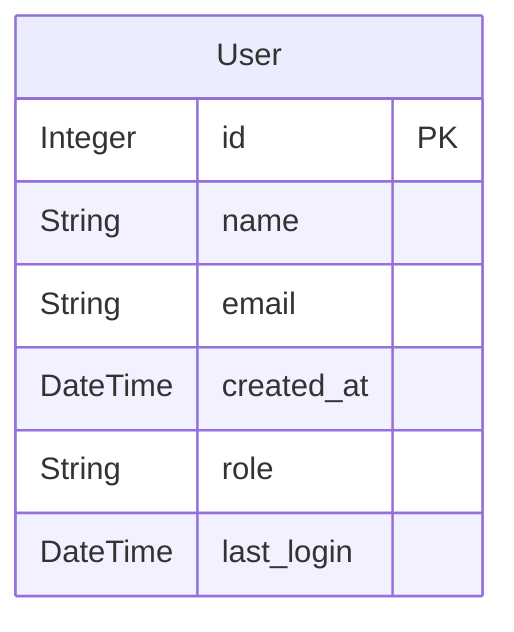

# User Management - Data Model

!!! warning
    The `backend/backend_code/data_model` module enforces strict data consistency as the single source of truth for all persistent data storage. All storage operations flow through this module to maintain data integrity and standardization.

## Core Architecture

The system uses SQLAlchemy's declarative base with a standard User model for data persistence. The system uses Aurora PostgreSQL as the primary storage backend, leveraging SQLAlchemy's native SQL database capabilities. This design delivers robust relational querying while maintaining flexibility through the database connection abstraction.

## Data Model

The system currently has a single primary entity - the `User`. This model represents each registered user in the system and includes essential user information and metadata.



## Model Fields

The User model contains the following fields:

1. `id`: Primary key, auto-incrementing integer
2. `name`: Required string field (255 characters max)
3. `email`: Required string field (255 characters max)
4. `created_at`: Timestamp with server-side default of current time
5. `role`: Optional string field (50 characters max)
6. `last_login`: Optional timestamp for tracking user activity

## Data Operations

All database operations are performed through FastAPI endpoints that ensure data consistency and proper error handling. Here's an example of creating a new user:

```python
from backend_code.data_model.models import User
from backend_code.db import get_db_connection

# Create a new user
with get_db_connection() as conn:
    with conn.cursor() as cursor:
        cursor.execute("""
            INSERT INTO users (name, email)
            VALUES (%s, %s)
            RETURNING id, name, email, created_at
        """, (user.name, user.email))

        result = dict(zip(
            [desc[0] for desc in cursor.description],
            cursor.fetchone()
        ))
        conn.commit()
```

To retrieve users:

```python
with get_db_connection() as conn:
    with conn.cursor() as cursor:
        cursor.execute("SELECT * FROM users")
        columns = [desc[0] for desc in cursor.description]
        rows = cursor.fetchall()
        users = [dict(zip(columns, row)) for row in rows]
```
