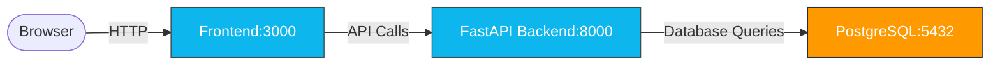

# Local Development

This project uses a simplified local development setup with separate commands for the database and backend services.

!!! Note
    Development requires a `GITHUB_TOKEN` exported as outlined [here](https://docs.resources.8090.dev/user_guide/installation/#javascript-packages).

## Development Setup

The development environment consists of:
- **Local PostgreSQL Database** - Running in Docker
- **Local FastAPI Backend** - Running directly with the `fastapi` command
- **Local Frontend** - Running separately (if needed)



## Available Commands

### Database Commands

Start the PostgreSQL database in Docker:
```bash
pnpm db:start
```

Stop the database:
```bash
pnpm db:stop
```

Reset the database (stops, removes volumes, and starts fresh):
```bash
pnpm db:reset
```

### Backend Commands

Start the FastAPI backend in development mode:
```bash
pnpm backend:dev
```

This will start the backend server at `http://localhost:8000` with hot reload enabled.

### Combined Development

Start both database and backend together:
```bash
pnpm dev
```

This command will:
1. Start the PostgreSQL database in Docker
2. Start the FastAPI backend with hot reload

## Development Workflow

1. **First time setup:**
   ```bash
   pnpm db:start
   # Wait for database to be ready (check with docker-compose logs)
   pnpm backend:dev
   ```

2. **Daily development:**
   ```bash
   pnpm dev
   ```

3. **Reset database when needed:**
   ```bash
   pnpm db:reset
   ```

## Database Configuration

The PostgreSQL database runs with the following configuration:
- **Host:** `localhost`
- **Port:** `5432`
- **Database:** `postgres`
- **Username:** `postgres`
- **Password:** `postgres`

The database data is persisted in a Docker volume, so it will retain data between restarts unless you use the `db:reset` command.

## Backend Configuration

The backend runs using the FastAPI development server which provides:
- **Hot reload** - Automatic restart on code changes
- **Debug mode** - Detailed error messages
- **Interactive API docs** - Available at `http://localhost:8000/docs`
- **Alternative docs** - Available at `http://localhost:8000/redoc`
