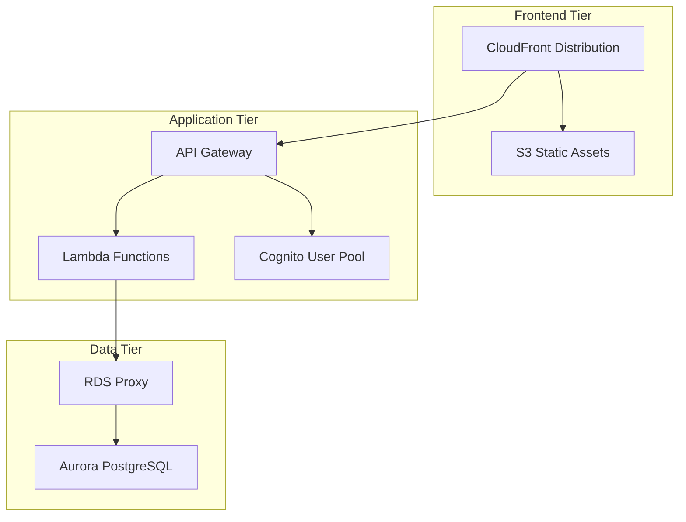
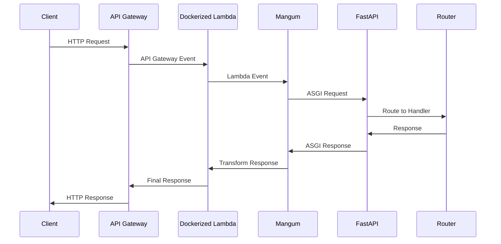
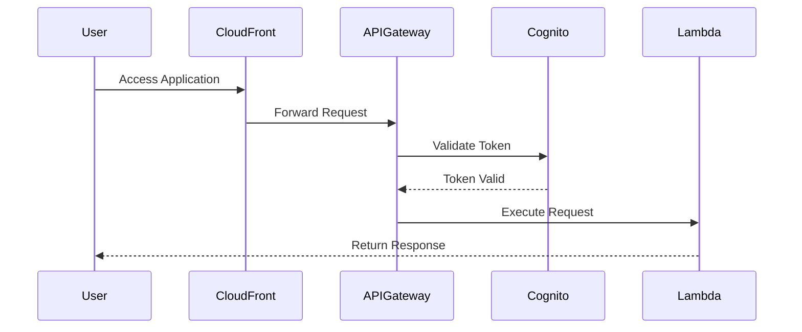
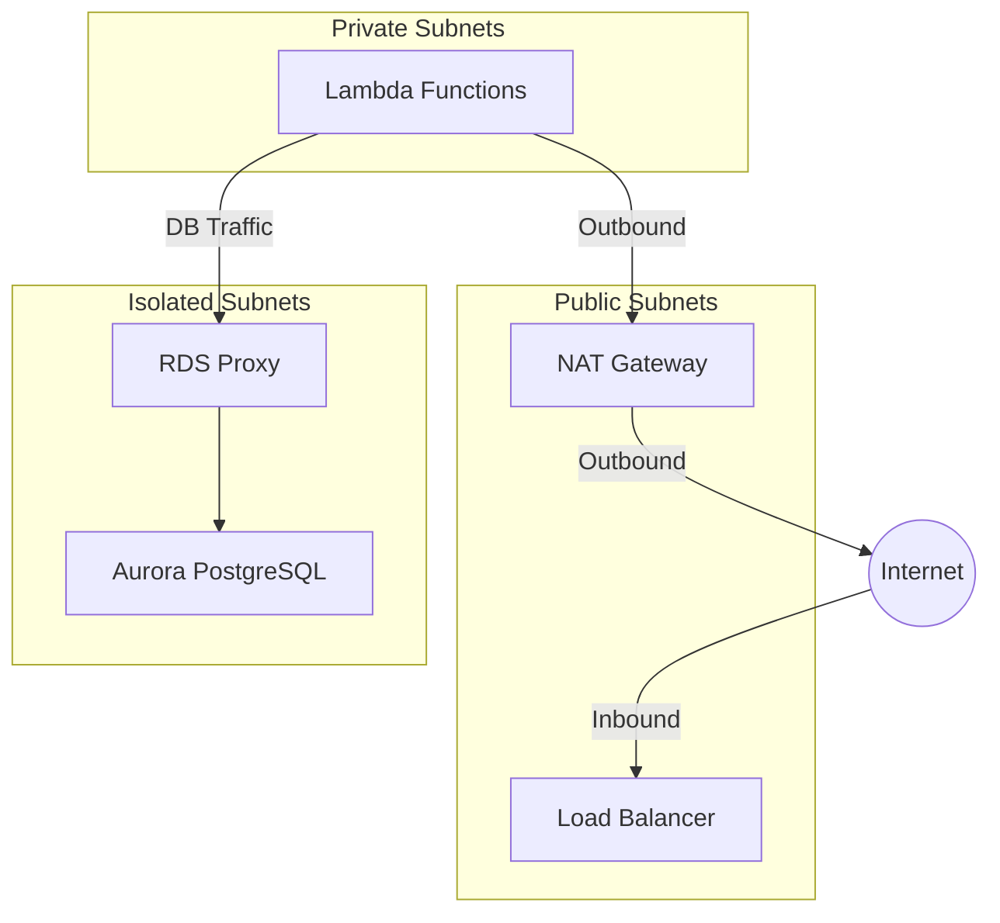

# AWS Infrastructure

This application uses AWS CDK with TypeScript to define and deploy infrastructure across three tiers.

## Overview

The system consists of three major components:

1. A frontend Vite application stored in S3 and served through CloudFront. The CloudFront distribution serves both static assets and API requests under one domain and is authenticated through Cognito.
2. An application tier that contains Python Lambda functions that handle application logic through API Gateway. Functions run in a VPC with security groups controlling network access. Docker packages the functions for deployment.
3. A data tier that contains an Aurora PostgreSQL database that stores all persisted data, accessed through RDS Proxy for connection management. The database runs in the same VPC as Lambda functions, with security groups limiting access.

These components are connected through the following diagram:



## Deployment Process

In order to deploy the CDK infrastructure, start by logging into the AWS account using the AWS CLI.

```bash
aws sso login --profile <profile-name>
export AWS_PROFILE=<profile-name>
```

Next, use the script located in the `infra/cdk/package.json` file to deploy the infrastructure.

```bash
cd infra/cdk
./deploy.sh -e dev
```

The `dev` can also be replaced with `stage` or `prod` to deploy to the respective environment. Please note, these deployments will all happen in the account specified in the `AWS_PROFILE` environment variable.

If you need to deploy to different accounts, login using sso to the other account, the run the same `./deploy.sh -e dev` command in another account.

## Data Layer

The data plane for this project is an Aurora PostgreSQL RDS instance. The code for the data plane is located in the `infra/src/constructs/database-construct.ts` file.

The Aurora RDS instance stores all persisted data and is provisioned using two constructs from the 8090 software factory library. The `AuroraConstruct` from `@8090-inc/aurora-rds` (defined in `infra/cdk/constructs/database-construct.ts`) is used to create the Aurora RDS instance and the `VpcConstruct` from `@8090-inc/vpc` (defined in `infra/cdk/src/stacks/infra-stack.ts`) is used to link the control tower VPC to the Aurora RDS instance.

Please see the [relational database user guide](https://stunning-adventure-ozgjm91.pages.github.io/usage_situations/relational_databases/) for more information regarding the CDK constructs and how they are used to create the Aurora RDS instance.

In order to connect to the database from a local instance, please see the [Database Connectivity](../../data-layer/database-connectivity.md) documentation.

## API Layer

The API Layer provides HTTP endpoints through API Gateway using a combination of Cognito, API Gateway, a Dockerized Lambda function, and FastAPI. If you want to read more about the APIs themselves or how the FastAPI server is deployed, please see the [API Documentation](../../api/index.md).

### Overview

The API architecture employs a single Docker container strategy that packages the entire `backend` module. This container is built using a common Dockerfile located at `/backend/Dockerfile`. All API endpoints are served through this single container, which hosts a FastAPI application that handles the routing and business logic for each endpoint.

The entrypoint to this container is defined in the `backend/backend_code/api/lambda_handler.py` file. This file is the universal Lambda handler that acts as a bridge between AWS Lambda events and a FastAPI application. This handler uses the Mangum library to translate Lambda events into ASGI-compatible requests that FastAPI can process. Every API request, regardless of its endpoint, flows through this single entry point.

The core of the API service is a FastAPI application (`backend/backend_code/api/app.py`) that serves as the central routing hub. This application registers multiple router modules (e.g., users, health) that contain the specific endpoint implementations. All routes operate within the same FastAPI application instance, ensuring consistent error handling, middleware, and dependency injection across all endpoints.

The place where the infrastructure is defined is in the `/infra/src/constructs/api-constructs.ts` file. The API Gateway routes defined in this file all point to the same Docker Lambda function, which is configured to use the universal Lambda handler (`backend.api.lambda_handler.main`). This standardization ensures that all API endpoints share the same environment, dependencies, and access patterns to backend services.

### Request Flow

The following diagram shows how a packet of data flows through the API Layer and back to the client. Please note, this diagram does not show the authentication process which is documented in the [Authentication](#authentication) section below.



## Authentication

Cognito handles user authentication:



The Cognito User Pool supports both localhost:3000 and production URLs. OAuth 2.0 handles callbacks and logout.

## Network

The VPC, created by `@8090-inc/vpc` in `infra/src/stacks/infra-stack.ts`, contains three subnet tiers. CloudFront and API Gateway run outside the VPC. NAT Gateways and Application Load Balancers run in public subnets. Lambda functions, defined in `infra/src/constructs/lambda-construct.ts`, run in private subnets with NAT access. Aurora PostgreSQL and RDS Proxy run in isolated private subnets. A Lambda security group in `infra/src/stacks/infra-stack.ts` allows outbound traffic, while the Aurora security group permits only RDS Proxy connections from Lambda functions.


