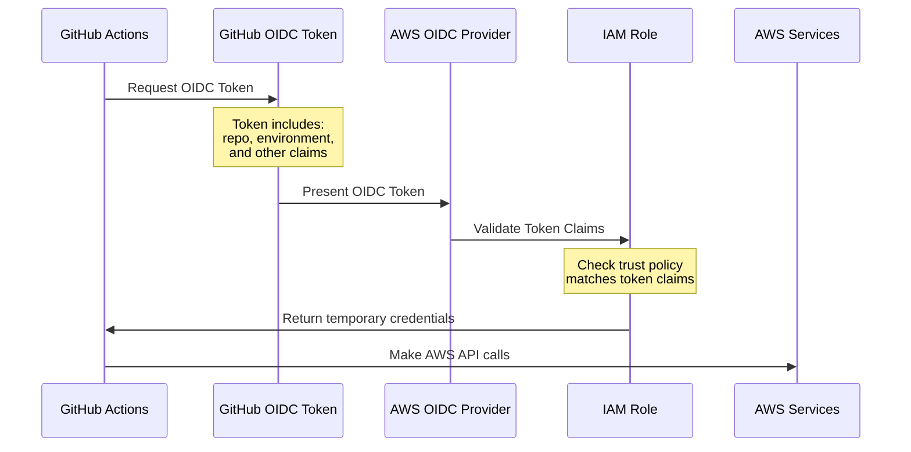
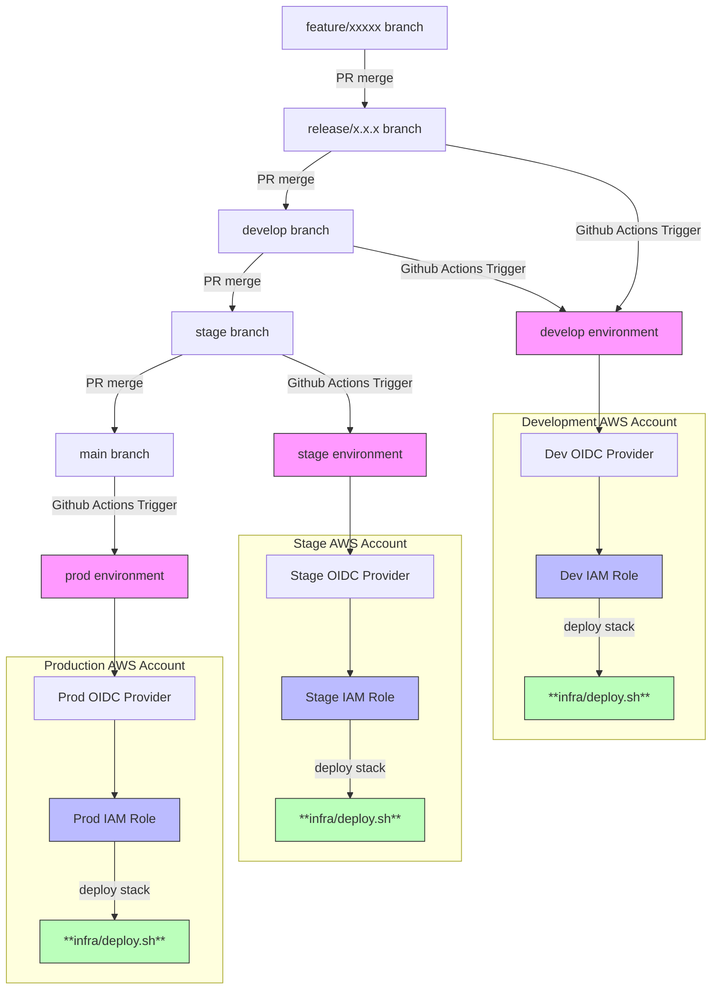
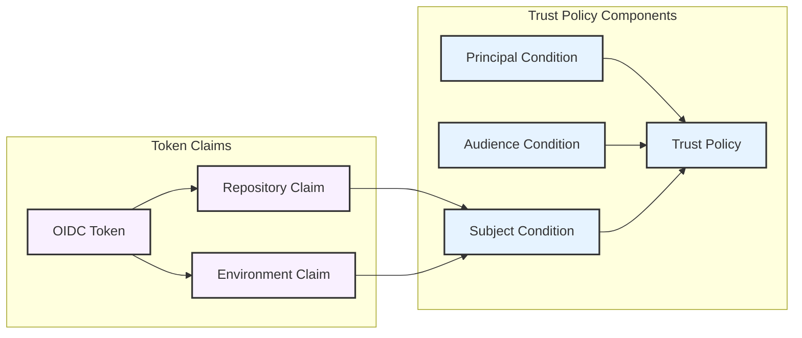

# GitHub Actions CICD

This guide describes how continuous integration and deployment is setup for the project infrastructure.

## Overview

Our CI/CD pipeline leverages GitHub Actions to automate infrastructure deployment across development, stage, and production environments. The pipeline implements OpenID Connect (OIDC) authentication between GitHub and AWS. This approach eliminates the security risks associated with storing long-lived credentials while providing seamless authentication during deployments.

### OIDC Authentication Flow

The following diagram illustrates how GitHub Actions authenticates with AWS using OIDC:



When a workflow runs, GitHub Actions requests an OIDC token containing specific claims about the repository and environment. This token is presented to AWS, which validates the claims against the trust policy of the appropriate IAM role. Upon successful validation, AWS provides temporary credentials that the workflow uses to make API calls.

### Environment and IAM Role Structure

The CI/CD setup creates a carefully structured relationship between GitHub environments and AWS IAM roles across separate AWS accounts:



Each branch is mapped to a specific GitHub environment, which in turn is authorized to assume a corresponding IAM role through the OIDC provider in its respective AWS account. This strict separation ensures that deployments from each branch can only access their intended AWS environment, with complete isolation between development, stage, and production resources.

The deployment process automatically determines the target environment based on the Git branch:

- `main` branch deploys to production
- `stage` branch deploys to stage
- `develop` branch deploys to development
- `release/*` branches deploy to development

### Security Architecture

The security model of this CI/CD setup is built around the principle of least privilege. The trust relationship between GitHub and AWS is configured through carefully structured policies:



The trust policy validates multiple components of the OIDC token:

- The Principal condition ensures the token comes from GitHub's OIDC provider
- The Audience condition verifies the token was intended for AWS
- The Subject condition checks the repository and environment claims match the expected values

This multi-layered validation ensures that only authorized GitHub workflows can assume the IAM roles, while OIDC authentication ensures credentials are short-lived and automatically rotated. Environment-specific IAM roles limit the scope of access to only what's necessary for each deployment stage. Branch protection rules prevent unauthorized deployments, while environment separation ensures that development activities cannot impact production resources.

## Setup Process

Due to the sensitive nature of these operations, this setup must be performed by a GitHub organization administrator who has the necessary permissions to configure environments, variables, and branch protection rules.

### Prerequisites

**If you are using multiple AWS accounts,** ensure you have three AWS accounts with SSO access. You'll need:

1. Administrator access to the GitHub repository
2. AWS SSO access configured for all three environments with administrative permissions:

   ```bash
   # Configure SSO for each environment
   aws configure sso --profile customer-dev
   aws configure sso --profile customer-stage
   aws configure sso --profile customer-prod
   ```

   Each profile must be configured with the AdministratorAccess role, as the CICD setup creates IAM resources.

3. Active SSO sessions for all three environments:
   ```bash
   # Log in to all three environments
   aws sso login --profile customer-dev
   aws sso login --profile customer-stage
   aws sso login --profile customer-prod
   ```

**If you are using a single AWS account for all environments,** ensure you have a single AWS account with SSO access using the same process as above.

### Run the Setup Script

The entire CI/CD configuration is automated through a script located at `infra/cicd/configure-cicd.sh`. This script orchestrates a series of operations that establish the complete deployment pipeline.

First, the script creates a standardized branching structure in your repository. It establishes three primary branches: `develop` for ongoing development work, `stage` for pre-production testing, and `main` for production deployments. This structure enforces a clear progression of code from development through to production.

Next, the script configures GitHub environments that map to these branches. Each environment is configured with specific branch protection rules that ensure deployments can only originate from their designated branches. For instance, production deployments are restricted to the `main` branch, preventing accidental deployments from development branches.

The script then handles the AWS side of the setup by deploying CloudFormation stacks that create the necessary IAM roles and OIDC providers. These resources are defined in `github-oidc-iam-role.yml` and establish the secure trust relationship between GitHub and AWS. If the CloudFormation stacks already exist, they will be updated in place, maintaining any existing OIDC connections while applying any template changes. The stack creates environment-specific IAM roles with carefully scoped permissions for deploying infrastructure. This IAM role also is used to install packages from the 8090 codeartifact repository. The `codeartifact:GetAuthorizationToken`, `codeartifact:ReadFromRepository`, and `sts:GetServiceBearerToken` permissions which are attached to the IAM role are specifically required for this reason.

Finally, the script configures the required GitHub environment variables, particularly the AWS role ARNs and region settings that the deployment workflow will use.

To execute the setup:

```bash
cd infra/cicd
chmod +x configure-cicd.sh
./configure-cicd.sh -d customer-dev -s customer-stage -p customer-prod
```

Please note this script can cause some cicd failures on the first run. This should be fixed once you go through the process described in the [section above](#environment-and-iam-role-structure).

The script accepts AWS profile names for each environment through the `-d`, `-s`, and `-p` flags, corresponding to development, stage, and production environments respectively. These profiles must be the same ones you configured with AWS SSO in the prerequisites section.

!!! note "Using a single AWS account for all environments"
If you are using a single AWS account for all environments, this script will still work. You simply need to pass the same profile name for all three environments. ie: `./configure-cicd.sh -d customer-dev -s customer-dev -p customer-dev`. This will create a single OIDC provider and IAM role for the account which will be reused in GitHub actions for each environment.

### Updating IAM Permissions

The setup script can also be used to update the IAM permissions for the IAM role. This is sometimes needed when you start using a new AWS service which was not previously configured in the `github-oidc-iam-role.yml` file.

To update the IAM permissions, first, update the `github-oidc-iam-role.yml` file to include the new permissions. Then, run the setup script again with the same AWS profile names as you did when you initially set up the CI/CD pipeline.

```bash
cd infra/cicd
./configure-cicd.sh -d customer-dev -s customer-stage -p customer-prod
```

This will update the cdk stack which defines the CDK role with the new permissions.

## Workflows

### Infra Deployment

The actual deployment process is defined in `.github/workflows/deploy.yml`. The workflow is commented out in this repository because the template does not run the deployment code each time. For a new Document Understanding repository, you will need to uncomment the workflow and push the changes to the repository.

Once enabled, this workflow automatically triggers when changes are pushed to any of the main branches (`release/*`, `develop`, `stage`, or `main`). It can also be manually triggered through GitHub's workflow dispatch feature. When the workflow runs, it first determines the target environment based on the triggering branch. It then uses OIDC to authenticate with AWS, assuming the appropriate IAM role for that environment. After setting up the necessary runtime environment with Node.js and Python, it executes the deployment script that uses AWS CDK to deploy the infrastructure.

This workflow script performs two core tasks:

1. Deploy the AWS CDK stacks which produce the infrastructure. This stacks are defined in `infra/cdk/`.
2. Execute any pending database migrations in the `backend/migrations` directory.

It should be noted that this workflow does not support a true blue/green deployment. Potential downtime must be communicated to the customer in advance when deploying to production.

### Documentation Publishing

Documentation is deployed automatically to github pages from the workflow defined in `.github/workflows/publish-documentation.yml`.

### Documentation Checking

By default, all pull requests are checked to have some form of documentation update in the `docs` directory. This is done by the workflow defined in `.github/workflows/documentation-check.yml`.

## Reference Files

The complete CI/CD setup spans several key files:

- `infra/cicd/configure-cicd.sh`: The main configuration script
- `infra/cicd/github-oidc-iam-role.yml`: AWS IAM role and OIDC provider definitions
- `.github/workflows/deploy.yml`: The GitHub Actions workflow definition
- `.github/workflows/publish-documentation.yml`: The GitHub Actions workflow definition for publishing documentation to github pages
- `.github/workflows/documentation-check.yml`: The GitHub Actions workflow definition for checking that pull requests have some form of documentation update in the `docs` directory
